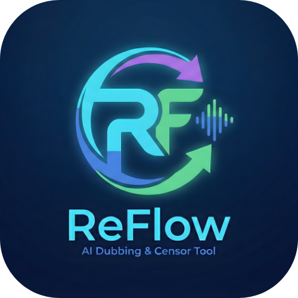

<div align="center">

# 🎙️ Reflow Studio v0.6.0
### The "Zero-Dependency" AI Neural Dubbing & Lip-Sync Workstation

[](https://www.python.org/)
[](https://pytorch.org/)
[](https://www.qt.io/)
[](LICENSE)

<br/>



<br/>

**Reflow Studio** is a local, privacy-focused AI workstation for video dubbing, voice cloning, and lip synchronization. It combines state-of-the-art models (**RVC**, **Wav2Lip**, **GFPGAN**, **XTTS**) into a single, cohesive "Cyberpunk" desktop interface designed for creators.

**New in v0.6.0:** The "Zero-Dependency" Update. Fully portable with **Embedded FFmpeg**, **Offline AI Models**, and a **Self-Healing Core**. Runs on a fresh Windows install (or USB stick) without installing Python or Drivers manually.

[Report Bug](https://github.com/user/Reflow-Studio/issues) · [Request Feature](https://github.com/user/Reflow-Studio/issues)

</div>


## 🎞️ Trailer

<div align="center">
  <video src="https://github.com/user-attachments/assets/35e31364-1610-4687-b974-8e1fd8c6b618" width="80%" controls></video>
</div>

---

## ✨ Key Features

| Feature | Description |
| :--- | :--- |
| **📦 Zero-Dependency** | **[NEW]** Runs completely offline from a USB stick. No Python or FFmpeg installation required. |
| **🤖 Neural Voice Cloning** | Clone voices instantly using **RVC (Retrieval-based Voice Conversion)**. |
| **👄 Wav2Lip Sync** | Automatically synchronize lip movements to match the new dubbed audio. |
| **✨ Face Enhancement** | Restore face details lost during lip-sync using **GFPGAN** (GPU Accelerated). |
| **🧹 Janitor System** | **[NEW]** Automatic "Hard Kill" switch and "Factory Reset" to wipe temp/cache files and prevent freezes. |
| **⚡ Smart Hardware** | **[NEW]** Automatically switches between **NVIDIA CUDA** (Performance) and **CPU** (Safe Mode). |
| **🎬 Embedded FFmpeg** | **[NEW]** Includes a local video engine, eliminating system PATH errors entirely. |

---

## 🎞️ Demo (UI)

> *The following is a raw view from Reflow Studio v0.5.3. Not v0.6.*

<div align="center">
  <video src="https://github.com/user-attachments/assets/f0f7a2d6-8159-4bd2-9742-de48ff652a1d" width="80%" controls></video>
</div>

---

## 🎞️ Test Sample

> *The following is a raw input and output from Reflow Studio.*

| **Original Input** | **Reflow Output** |
| :---: | :---: |
| <video src="https://github.com/user-attachments/assets/b144775c-947f-423a-a328-15b576f53c04" width="100%" controls></video> | <video src="https://github.com/user-attachments/assets/f89e78e1-c5b7-4e09-8843-768e21e1bfca" width="100%" controls></video> |

---

## 🛠️ Installation

### Option A: The One-Click Portable App (Recommended)
**No coding required. No installation required.**

1. Download **`Reflow_Portable_v0.6.zip`** from [**Releases**](https://github.com/ananta-sj/Reflow-Studio/releases).
2. Extract the folder to a short path (e.g., `D:\Reflow` or your USB Drive). 
   * *Note: Avoid "C:\Program Files" to prevent permission issues.*
3. Double-click **`Launch_Reflow.bat`**.

> **OFFLINE NOTE:** The first run requires internet to fetch the AI models (~2GB). After that, the app is 100% offline.

---

### Option B: Developer Setup (Source)
If you want to modify the Python code directly.

**Prerequisites:**
* Python 3.10
* NVIDIA GPU (Recommended) with CUDA 11.8+
* FFmpeg installed and added to System PATH

```bash
# 1. Clone the repo
git clone [https://github.com/user/Reflow-Studio.git](https://github.com/user/Reflow-Studio.git)
cd Reflow-Studio

# 2. Create a virtual environment
python -m venv venv
source venv/bin/activate  # On Windows use: venv\Scripts\activate

# 3. Install PyTorch (CUDA 11.8)
pip install torch torchvision torchaudio --index-url [https://download.pytorch.org/whl/cu118](https://download.pytorch.org/whl/cu118)

# 4. Install dependencies
pip install -r requirements.txt

# 5. Run the Studio
python studio_gui_v0.6.py

```
## 🎛️ Usage Guide

### 1. The Job Queue
* **Batch Processing:** Drag and drop multiple videos into the queue. Reflow will process them one by one.
* **Voice Reference:** Upload a `.wav` file to clone a specific voice, or let the AI "Auto-Clone" the original speaker.

### 2. Configuration Tab
* **Target Language:** Select from English, Hindi, Spanish, French, Japanese, etc.
* **Pro Features:**
    * `🎵 Preserve Background`: Uses UVR5 to separate music from vocals before dubbing.
    * `👄 Lip Sync`: Forces the mouth to move with the new language.
    * `✨ Face Enhancer`: Upscales the face (slow but high quality).
    * `📝 Burn Subtitles`: Hardcodes English subtitles into the video.

### 3. The "Janitor" & Safety
* **Factory Clean:** Found in the left panel. Use this to wipe `temp/`, `output/`, and `__pycache__` if the app feels sluggish.
* **Kill Switch:** The "CANCEL" button now performs a hard process kill, instantly stopping FFmpeg or AI rendering loops.

---

## 📂 Project Structure (Portable)
```
Reflow_Portable_v0.6/
│
├── core/                       # 🧠 Backend Logic & AI Pipelines
│   ├── pipeline.py             # Main orchestration (TTS -> RVC -> LipSync)
│   ├── tts/
│   │   └── tts_handler.py      # XTTS v2 Handler
│   ├── rvc/
│   │   └── rvc_handler.py      # RVC Voice Conversion logic
│   ├── lipsync/
│   │   └── lipsync_handler.py  # Wav2Lip Inference wrapper
│   └── enhancer.py             # GFPGAN Face Restoration logic
│
├── ffmpeg/                     # 🎬 Embedded Video Engine (Portable)
│   ├── bin/
│   │   ├── ffmpeg.exe
│   │   └── ffprobe.exe
│   └── licenses/
│
├── models/                     # 🤖 AI Weights (Offline)
│   ├── tts/                    # XTTS v2 Checkpoints
│   ├── rvc/                    # Voice Models (.pth)
│   └── gfpgan/                 # GFPGANv1.4.pth
│
├── python.exe                  # 🐍 Embedded Python Runtime
│
├── assets/                     # 🎨 UI Resources
│   ├── themes/                 # Cyberpunk qss/css theme files
│   └── icons/                  # .png/.ico assets
│
├── temp/                       # 🧹 Temporary Processing Cache (Auto-cleared)
├── output/                     # 💾 Final Rendered Videos
│
├── studio_gui_v0.6.py          # 🖥️ Main Application Entry Point (PyQt6)
├── Launch_Reflow.bat           # 🚀 One-Click Portable Launcher
├── README.md                   # 📖 Documentation
└── requirements.txt            # 📦 Dependency List (Reference only)
```
---

## 🤝 Acknowledgements

This project stands on the shoulders of giants. Special thanks to the open-source community:

* **[Coqui-TTS](https://github.com/coqui-ai/TTS)** - XTTS v2 Text-to-Speech & Voice Cloning.
* **[RVC-Project](https://github.com/RVC-Project/Retrieval-based-Voice-Conversion-WebUI)** - Retrieval-based Voice Conversion.
* **[Wav2Lip](https://github.com/Rudrabha/Wav2Lip)** - Lip synchronization.
* **[GFPGAN](https://github.com/TencentARC/GFPGAN)** - Face restoration.
* **[PyQt6](https://pypi.org/project/PyQt6/)** - The Desktop UI framework.

---

<div align="center">
  
*Reflow Studio* © 2026
Built with ❤️ by Reflow Studio Team

</div>

</div>
